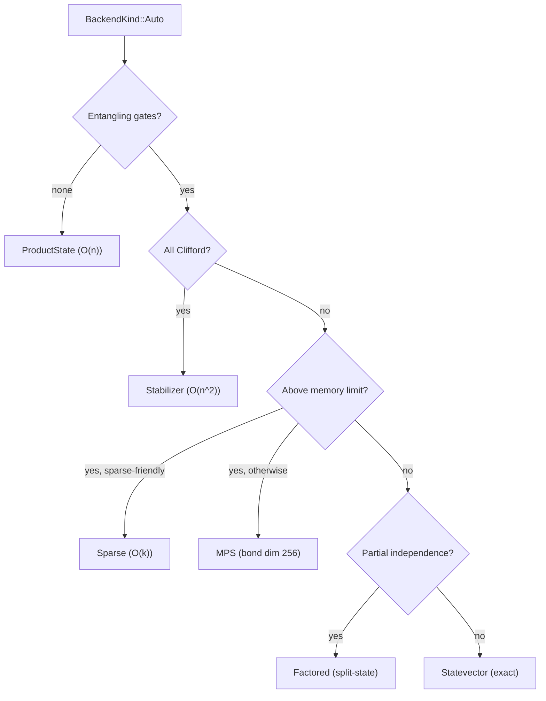

# Simulation Engine and Dispatch

## Backend trait

```rust
pub trait Backend {
    fn name(&self) -> &'static str;
    fn init(&mut self, num_qubits: usize, num_classical_bits: usize) -> Result<()>;
    fn apply(&mut self, instruction: &Instruction) -> Result<()>;
    fn classical_results(&self) -> &[bool];
    fn probabilities(&self) -> Result<Vec<f64>>;
    fn num_qubits(&self) -> usize;

    // Optional overrides:
    fn apply_instructions(&mut self, instructions: &[Instruction]) -> Result<()>;  // batch apply
    fn supports_fused_gates(&self) -> bool;   // false for symbolic backends (stabilizer)
    fn export_statevector(&self) -> Result<Vec<Complex64>>;  // for backend transitions
}
```

Contract: `init` before `apply`. Instructions arrive in circuit order. Measurement is destructive. Deterministic given same RNG seed.

## Entry points

Orchestration layer in `src/sim/mod.rs`.

| Function | Description |
|----------|-------------|
| `simulate(circuit).seed(seed).run()` | Auto-dispatch, full output |
| `simulate(circuit).backend(kind).seed(seed).run()` | Explicit backend selection |
| `simulate(circuit).seed(seed).shots(shots)` | Multi-shot sampling |
| `simulate(circuit).backend(kind).seed(seed).shots(shots)` | Multi-shot with backend selection |
| `simulate(circuit).backend(kind).noise(noise).seed(seed).shots(shots)` | Noisy multi-shot |
| `simulate(circuit).seed(seed).sample_counts(shots)` | Auto-dispatched frequency histogram |
| `simulate(circuit).backend(kind).seed(seed).sample_counts(shots)` | Frequency histogram with backend selection |
| `simulate(circuit).seed(seed).marginals()` | Auto-dispatched per-qubit marginal probabilities |
| `simulate(circuit).backend(kind).seed(seed).marginals()` | Per-qubit marginal probabilities with backend selection |
| `run_on(backend, circuit)` | Pre-constructed backend |
| `run_qasm(qasm, seed)` | Parse + simulate |

`RunOutcome::probabilities` is `None` only when the selected backend cannot
expose a dense probability distribution for the requested circuit, such as
factored stabilizer or decomposed runs above the dense output cap. Other
probability extraction failures propagate as errors. `marginals()` requires
either a direct Pauli marginal route or backend probability output; it returns
`BackendUnsupported` instead of fabricating uniform marginals when neither path
is available. Stochastic and deterministic Pauli marginal backends accept only
unitary Clifford+T circuits without measurement, reset, or conditional
instructions.

## Auto-dispatch decision tree



Memory limit is dynamically computed from available system RAM (50% budget, capped at 33 qubits). Overridable via `PRISM_MAX_SV_QUBITS` environment variable. Falls back to 28 qubits (4 GB) when detection unavailable.

For a user-facing version of this decision, see [Choosing a Backend](../getting-started/choosing-a-backend.md).

## Subsystem decomposition

Union-find detects independent qubit groups in O(n·α(n)). Each block runs separately with per-block Auto dispatch. Results merge lazily via `Probabilities::Factored`, a Kronecker product computed on demand per element in O(K), avoiding the O(2^N) dense materialization unless explicitly requested.

Block-level Rayon parallelism when all blocks are <14 qubits (avoids oversubscription with block-internal parallelism).

## Temporal Clifford decomposition

For Clifford+T circuits: Clifford prefix runs on the Stabilizer backend, state is exported to Statevector for the non-Clifford tail. Saves exponential memory for circuits with a long Clifford preamble.

## Backend dispatch variants

All `BackendKind` variants:

| Variant | Backend | Selection |
|---------|---------|-----------|
| `Auto` | Decision tree (see above) | Default |
| `Statevector` | Full state-vector | Explicit |
| `Stabilizer` | Aaronson-Gottesman tableau | Explicit or auto (all Clifford) |
| `FactoredStabilizer` | Per-cluster tableaux | Explicit or auto (large independent Clifford blocks) |
| `Sparse` | HashMap state | Explicit or auto (above memory limit, sparse-friendly) |
| `Mps { max_bond_dim }` | Matrix Product State | Explicit or auto (above memory limit) |
| `ProductState` | Per-qubit product | Explicit or auto (no entangling) |
| `TensorNetwork` | Deferred contraction | Explicit |
| `Factored` | Dynamic split-state | Explicit or auto (partial independence) |
| `StabilizerRank` | Weighted stabilizer sum | Explicit |
| `StochasticPauli { num_samples }` | SPP | Explicit |
| `DeterministicPauli { epsilon, max_terms }` | SPD | Explicit |
