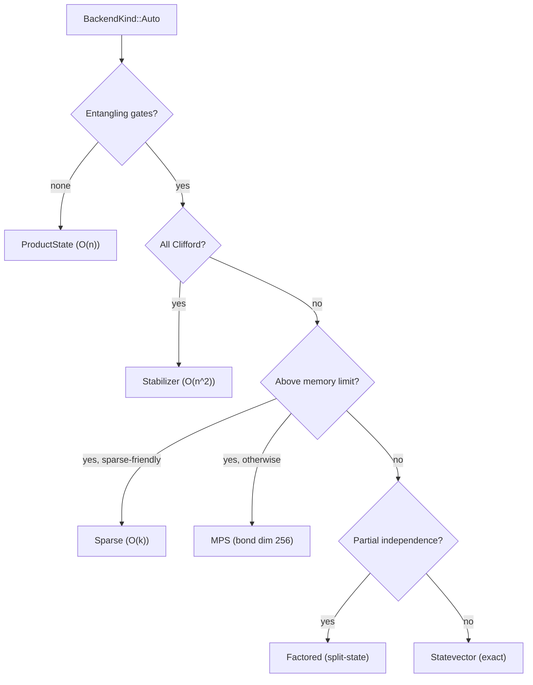

# Simulation Engine and Dispatch

## Backend trait

```rust
pub trait Backend {
    fn name(&self) -> &'static str;
    fn init(&mut self, num_qubits: usize, num_classical_bits: usize) -> Result<()>;
    fn apply(&mut self, instruction: &Instruction) -> Result<()>;
    fn classical_results(&self) -> &[bool];
    fn probabilities(&self) -> Result<Vec<f64>>;
    fn num_qubits(&self) -> usize;

    // Optional overrides:
    fn apply_instructions(&mut self, instructions: &[Instruction]) -> Result<()>;  // batch apply
    fn supports_fused_gates(&self) -> bool;   // false for symbolic backends (stabilizer)
    fn export_statevector(&self) -> Result<Vec<Complex64>>;  // for backend transitions
}
```

Contract: `init` before `apply`. Instructions arrive in circuit order. Measurement is destructive. Deterministic given same RNG seed.

## Entry points

Orchestration layer in `src/sim/mod.rs`.

| Function | Description |
|----------|-------------|
| `simulate(circuit).seed(seed).run()` | Auto-dispatch, full output |
| `simulate(circuit).backend(kind).seed(seed).run()` | Explicit backend selection |
| `simulate(circuit).seed(seed).shots(shots)` | Multi-shot sampling |
| `simulate(circuit).backend(kind).seed(seed).shots(shots)` | Multi-shot with backend selection |
| `simulate(circuit).backend(kind).noise(noise).seed(seed).shots(shots)` | Noisy multi-shot |
| `simulate(circuit).backend(density_matrix).noise(noise).seed(seed).run()` | Exact noisy distribution |
| `simulate(circuit).backend(density_matrix).noise(noise).seed(seed).marginals()` | Exact noisy marginals |
| `simulate(circuit).backend(density_matrix).noise(noise).seed(seed).expectation_values(obs)` | Exact `Tr(rho P_k)` |
| `simulate(circuit).seed(seed).sample_counts(shots)` | Auto-dispatched frequency histogram |
| `simulate(circuit).backend(kind).seed(seed).sample_counts(shots)` | Frequency histogram with backend selection |
| `simulate(circuit).seed(seed).marginals()` | Auto-dispatched per-qubit marginal probabilities |
| `simulate(circuit).backend(kind).seed(seed).marginals()` | Per-qubit marginal probabilities with backend selection |
| `simulate(circuit).seed(seed).expectation_values(observables)` | `⟨P_k⟩` per Pauli string |
| `simulate(circuit).seed(seed).expectation_gradient(hamiltonian, params)` | `⟨H⟩` and adjoint gradient |
| `simulate(circuit).backend(kind).seed(seed).expectation_gradient_shift(hamiltonian, params)` | `⟨H⟩` and parameter-shift gradient |
| `run_on(backend, circuit)` | Pre-constructed backend |
| `run_qasm(qasm, seed)` | Parse + simulate |

`RunOutcome::probabilities` is `None` only when the selected backend cannot
expose a dense probability distribution for the requested circuit, such as
factored stabilizer or decomposed runs above the dense output cap. Other
probability extraction failures propagate as errors. `marginals()` requires
either a direct Pauli marginal route or backend probability output; it returns
`BackendUnsupported` instead of fabricating uniform marginals when neither path
is available. Stochastic and deterministic Pauli marginal backends accept only
unitary circuits of Clifford gates and Pauli rotations without measurement,
reset, or conditional instructions: `T`, `Tdg`, `Rz`, `P`, and the two-qubit
`Rzz` branch natively, while `Rx`, `Ry`, and multi-qubit `PauliRot` strings
lower to Clifford conjugation around one `Rz` before the run. Automatic dispatch
still routes only Clifford+T circuits to SPD; a circuit carrying arbitrary
rotation angles reaches the Pauli engines by explicit backend selection.

## Noise across the terminals

A noise model reaches a terminal by one of two routes, and which one applies is fixed by
the selected backend rather than by the terminal.

Backends holding a per-shot pure state average trajectories: each shot re-evolves the
circuit with the channels sampled, so a distribution converges as `1/sqrt(shots)`. Only
`shots` and `sample_counts` take that route, since a single trajectory is not an answer
to `run`, `marginals`, or `expectation_values`.

The density matrix holds the mixture instead of a trajectory, so `shots` cannot mean
"replay the circuit per shot". It means one exact evolution followed by a draw per shot
from the resulting distribution. Every terminal reads that one evolution: `run` and
`marginals` return the exact noisy distribution, `expectation_values` returns the exact
`Tr(rho P)`, and `shots` and `sample_counts` carry sampling noise but no trajectory
variance. Readout error is applied to the drawn outcomes rather than to the state, on an
RNG stream of its own.

The mixture holds every measurement branch at once, which is what makes it exact and also
what it cannot undo. A circuit with mid-circuit measurement or classical conditioning is
rejected on this route, with or without a noise model attached: the outcome that a later
gate would have been conditioned on was never fixed. The rejection sits on the evolution
itself, so `density_matrix_expectation_values` refuses the same circuits the `Simulate`
terminals do. Those circuits stay on trajectory averaging. This is the
same property that makes the density matrix the mixture oracle rather than a comparable
participant in the branching families of `tests/conformance_matrix.rs`.

`expectation_gradient` rejects a noise model on every backend, because the adjoint method
backpropagates through a pure state. `expectation_gradient_shift` accepts one on the
density-matrix kinds: the channels do not depend on the shifted angle, so the shift rule
holds and each of the `1 + 2 * links` evaluations reads the exact mixture. Every other
backend rejects the pair, naming the density matrix.

## Result provenance

Every terminal returns a result carrying a `RunMetadata`: the resolved engine,
whether that engine is exact, where the state lived, and the shot count for a
sampled result. `Auto` selecting an approximate backend is disclosed by the
result, which is what makes `require_exact()` an opt-out: rejecting by default
would remove the only route an oversize non-sparse circuit has.

`require_exact()` resolves the route from the circuit and errors before
allocating, so it does not pay for state it would discard. Sparse Pauli dynamics
truncates on coefficient magnitudes it only learns while propagating, so that
route cannot be decided in advance and is caught by a second check on the
finished result. Both checks run in every terminal.

## Auto-dispatch decision tree


```mermaid
flowchart TD
    A[BackendKind::Auto] --> E{Entangling gates?}
    E -- none --> PS["ProductState (O(n))"]
    E -- yes --> CL{All Clifford?}
    CL -- yes --> STB["Stabilizer (O(n^2))"]
    CL -- no --> MEM{Above memory limit?}
    MEM -- "yes, sparse-friendly" --> SPR["Sparse (O(k))"]
    MEM -- "yes, otherwise" --> MPS["MPS (bond dim 256)"]
    MEM -- no --> IND{Partial independence?}
    IND -- yes --> FAC["Factored (split-state)"]
    IND -- no --> SV["Statevector (exact)"]
```

Memory limit is dynamically computed from available system RAM (50% budget, capped at 33 qubits). Overridable via `PRISM_MAX_SV_QUBITS` environment variable. Falls back to 28 qubits (4 GB) when detection unavailable.

For a user-facing version of this decision, see [Choosing a Backend](../getting-started/choosing-a-backend.md).

## Start states other than |0...0>

`Simulate::initial_state` bypasses the tree above entirely. Every branch of it
reads circuit structure alone and is sound only from the all-zero start: a
Clifford circuit yields a stabilizer state when its input is one, the product
state and the subsystem split assume an unentangled input, and the Pauli engines
propagate observables back to |0...0>. Picking one of them for an arbitrary
start state returns a wrong answer rather than an error, so `initial_state_plan`
in `src/sim/dispatch.rs` constrains the route instead of consulting it: `Auto`
resolves to the statevector, `DensityMatrix` is the only other backend that
accepts one (as the pure mixture `|psi><psi|`), and every other kind returns
`IncompatibleBackend`. Auto needs no memory check on that path, since a caller
holding `2^n` amplitudes can already afford the dense state.

The amplitude vector is validated before the run: `2^n` entries for the
circuit's `n` qubits, every component finite, and unit norm to 1e-9. An
unnormalized vector is rejected rather than rescaled, because the statevector's
deferred-normalization factor is reset to 1 by the load and a silent rescale
would hide the error inside it.

## Subsystem decomposition

Union-find detects independent qubit groups in O(n·α(n)). Each block runs separately with per-block Auto dispatch. Results merge lazily via `Probabilities::Factored`, a Kronecker product computed on demand per element in O(K), avoiding the O(2^N) dense materialization unless explicitly requested.

Block-level Rayon parallelism when all blocks are <14 qubits (avoids oversubscription with block-internal parallelism).

## Temporal Clifford decomposition

For Clifford+T circuits: Clifford prefix runs on the Stabilizer backend, state is exported to Statevector for the non-Clifford tail. Saves exponential memory for circuits with a long Clifford preamble.

## Expectation-value gradients

Two methods, chosen by the caller rather than by the engine: the adjoint method is the
default and the reference, parameter shift is the fallback for what the adjoint declines.
Selection is explicit because the two differ by a factor of `2 * links` in evaluation
count, which is not a difference a caller should discover from a wall clock.

### Adjoint method

`run_expectation_gradient(circuit, hamiltonian, params, seed)` and
`simulate(circuit).seed(seed).expectation_gradient(hamiltonian, params)` compute
`⟨H⟩` and the exact gradient `d⟨H⟩/dθ` for a weighted Pauli-sum Hamiltonian
`H = Σ c_k P_k`, at a cost independent of the parameter count. Implementation in
`src/sim/gradient.rs`.

The method back-propagates two statevectors. With `U = U_L…U_1` and `|φ⟩ = U|0⟩`:

1. Forward pass (unfused) keeps `|φ⟩`. Build `|λ⟩ = H|φ⟩`; the value is
   `Re⟨φ|λ⟩`.
2. Sweep `i = L…1`. For a trainable gate with generator `G_i`, accumulate
   `Im⟨λ|G_i|φ⟩` (projector form for `P`), then step both states back through
   `U_i†` (`Gate::inverse()`).

The `⟨λ|G|φ⟩` sandwich generalizes the forward `pauli_expectation_from_masks`
kernel to two vectors (`pauli_sandwich`, Rayon-parallel at 16+ qubits).

Differentiable gates are `Rx`, `Ry`, `Rz`, `Rzz`, `P`, and `PauliRot` (identified by
`Gate::pauli_generator`, a method, so `Gate` stays 16 bytes). A multi-qubit Pauli
rotation is `exp(-iθP/2)` like the named rotations, so its generator is the string
itself: `GeneratorKind::RotPauli` borrows the letters off the gate, and the sandwich
takes the masks they imply rather than a per-variant special case. Trainable links on
other gates, non-unitary instructions, and `QftBlock` are rejected. Parameter
identity is an index-based side table (`Parameters`, instruction→slot links
recorded by `CircuitBuilder::param`); many gates may share a slot.

Differentiation runs on the unfused instruction stream so each gate keeps a 1:1
correspondence with its generator (fusion would erase both the stored angle and
that correspondence). Two prunings cut work without changing results: the sweep
stops at the earliest in-cone trainable gate (a non-trainable prefix costs no
inverse applications), and a trainable gate outside the Hamiltonian's inverse
light cone has a provably zero gradient, so its sandwich is skipped.

Memory is two statevectors, so the qubit ceiling is about one below a single
run. Only the statevector backend is supported.

### Parameter shift (fallback)

`run_expectation_gradient_shift(circuit, hamiltonian, params, seed)` and
`simulate(circuit).backend(kind).seed(seed).expectation_gradient_shift(hamiltonian,
params)` evaluate `d⟨H⟩/dθ = (f(θ+π/2) - f(θ-π/2)) / 2` per trainable gate, exactly, from
forward `expectation_values` calls alone. That is what makes it the fallback: it inherits
whatever the selected backend can represent, so it serves Sparse, MPS, Factored,
ProductState, DensityMatrix, and Distributed, widths past the statevector cap, and
circuits containing `QftBlock`. A backend with no native observable path reports
`BackendUnsupported` naming itself.

The rule is exact because each differentiable gate is `exp(-iθG/2)` with `G` of
eigenvalues `±1`, making `⟨H⟩` a degree-1 trigonometric polynomial in that angle. `P(θ)`
is the apparent exception, its generator being the projector `|1⟩⟨1|` with eigenvalues
`{0, 1}`, but `P(θ) = e^{iθ/2} Rz(θ)` and that scalar cancels against its conjugate in
`⟨ψ|H|ψ⟩` wherever the gate sits, so the same shift applies.

The differentiable gate set is the same one the adjoint takes: `Rx`, `Ry`, `Rz`, `Rzz`,
`P`, and `PauliRot` are the `Gate` variants carrying a rotation angle, so parameter shift
reaches no gate the adjoint rejects. Its reach is backends and circuit shapes, not gates.
A `PauliRot` on a backend without the native kernel is shifted in the same place, because
the ladder expansion happens below the forward evaluation the rule calls.

Gates sharing a parameter slot are shifted one at a time and their contributions summed.
Shifting them together is a different quantity: two `Rx(θ)` on one qubit under `⟨Z⟩` give
`cos 2θ`, whose joint ±π/2 shift is zero rather than `-2 sin 2θ`.

Cost is `1 + 2 * links` circuit evaluations against the adjoint's one, and there is no
light-cone pruning to recover any of it: a trainable gate with a provably zero gradient is
still evaluated twice. Evaluations run in sequence, because each already drives a
Rayon-parallel backend run and holding several in flight would multiply peak state memory
by the parameter count, which is the resource this path exists to stay under.

## Backend dispatch variants

All `BackendKind` variants:

| Variant | Backend | Selection |
|---------|---------|-----------|
| `Auto` | Decision tree (see above) | Default |
| `Statevector` | Full state-vector | Explicit |
| `Stabilizer` | Aaronson-Gottesman tableau | Explicit or auto (all Clifford) |
| `FactoredStabilizer` | Per-cluster tableaux | Explicit or auto (large independent Clifford blocks) |
| `Sparse` | HashMap state | Explicit or auto (above memory limit, sparse-friendly) |
| `Mps { max_bond_dim }` | Matrix Product State | Explicit or auto (above memory limit) |
| `ProductState` | Per-qubit product | Explicit or auto (no entangling) |
| `TensorNetwork` | Deferred contraction | Explicit |
| `Factored` | Dynamic split-state | Explicit or auto (partial independence) |
| `StabilizerRank` | Weighted stabilizer sum | Explicit |
| `StochasticPauli { num_samples }` | SPP | Explicit |
| `DeterministicPauli { epsilon, max_terms }` | SPD | Explicit |
| `PauliPath { epsilon, max_terms }` | Noisy Heisenberg Pauli sum | Explicit |
