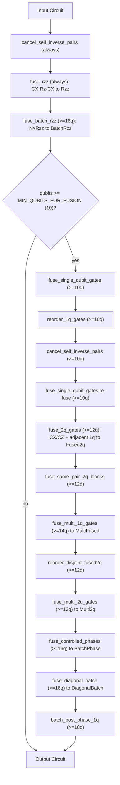

# Fusion Pipeline

Gate optimizations before execution, gated by qubit count thresholds. Every pass returns `Cow<Circuit>`. `Borrowed` when no optimization applies, so circuits that do not benefit pay zero overhead.



## Threshold constants

| Constant | Value | Rationale |
|----------|-------|-----------|
| `MIN_QUBITS_FOR_FUSION` | 10 | Below this, clone cost exceeds simulation savings |
| `MIN_QUBITS_FOR_MULTI_FUSION` | 14 | MultiFused tiling overhead vs benefit |
| `MIN_QUBITS_FOR_DIAG_BATCH` | 16 | Diagonal batch, cphase, and Rzz batching |
| `MIN_QUBITS_FOR_POST_PHASE_BATCH` | 18 | Post-phase 1q re-batching |
| `MIN_QUBITS_FOR_2Q_FUSION` | 12 | Benchmarked QV and random sweeps show memory-pass reduction wins from 12q |
| `MIN_QUBITS_FOR_MULTI_2Q_FUSION` | 12 | Same as 2q fusion |

```admonish tip
Fusion is not on the hot path. Worst-case fusion cost is on the order of microseconds
against tens of milliseconds of gate application, so these passes are tuned for
correctness and clarity, not for their own runtime.
```
