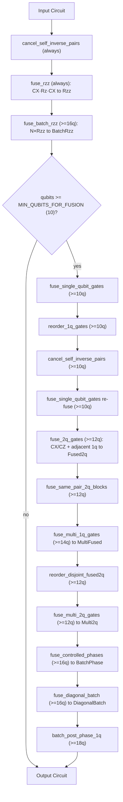

# Fusion Pipeline

Gate optimizations before execution, gated by qubit count thresholds. Every pass returns `Cow<Circuit>`. `Borrowed` when no optimization applies, so circuits that do not benefit pay zero overhead.


```mermaid
flowchart TD
    IN[Input Circuit] --> P0["cancel_self_inverse_pairs (always)"]
    P0 --> P0r["fuse_rzz (always): CX&middot;Rz&middot;CX to Rzz"]
    P0r --> P0b["fuse_batch_rzz (>=16q): N&times;Rzz to BatchRzz"]
    P0b --> G{"qubits >= MIN_QUBITS_FOR_FUSION (10)?"}
    G -- no --> OUT[Output Circuit]
    G -- yes --> P1["fuse_single_qubit_gates (>=10q)"]
    P1 --> P1r["reorder_1q_gates (>=10q)"]
    P1r --> P1c["cancel_self_inverse_pairs (>=10q)"]
    P1c --> P1f["fuse_single_qubit_gates re-fuse (>=10q)"]
    P1f --> P2q["fuse_2q_gates (>=12q): CX/CZ + adjacent 1q to Fused2q"]
    P2q --> P2qb["fuse_same_pair_2q_blocks (>=12q)"]
    P2qb --> P2["fuse_multi_1q_gates (>=14q) to MultiFused"]
    P2 --> P2qr["reorder_disjoint_fused2q (>=12q)"]
    P2qr --> Pm2q["fuse_multi_2q_gates (>=12q) to Multi2q"]
    Pm2q --> Pcp["fuse_controlled_phases (>=16q) to BatchPhase"]
    Pcp --> Pdb["fuse_diagonal_batch (>=16q) to DiagonalBatch"]
    Pdb --> Ppp["batch_post_phase_1q (>=18q)"]
    Ppp --> OUT
```

## Threshold constants

| Constant | Value | Rationale |
|----------|-------|-----------|
| `MIN_QUBITS_FOR_FUSION` | 10 | Below this, clone cost exceeds simulation savings |
| `MIN_QUBITS_FOR_MULTI_FUSION` | 14 | MultiFused tiling overhead vs benefit |
| `MIN_QUBITS_FOR_DIAG_BATCH` | 16 | Diagonal batch, cphase, and Rzz batching |
| `MIN_QUBITS_FOR_POST_PHASE_BATCH` | 18 | Post-phase 1q re-batching |
| `MIN_QUBITS_FOR_2Q_FUSION` | 12 | Benchmarked QV and random sweeps show memory-pass reduction wins from 12q |
| `MIN_QUBITS_FOR_MULTI_2Q_FUSION` | 12 | Same as 2q fusion |

## Payload capacities

The batched gates carry a lookup table sized at compile time, so the pass that emits
them is what keeps the payload inside it. Both caps are declared on the gate payload
(`BatchRzzData::MAX_EDGES`, `BatchPhaseData::MAX_PHASES`) and pinned to the kernel
table shape by a compile-time assertion; the kernels assert on entry in release builds
as well, so a producer that outgrows a table fails loudly instead of dropping work.

| Payload      | Cap        | Producer behavior past the cap                                     |
|--------------|------------|--------------------------------------------------------------------|
| `BatchRzz`   | 32 edges   | `fuse_batch_rzz` splits the run into consecutive batches           |
| `BatchPhase` | 40 entries | `fuse_controlled_phases` splits the chain into consecutive batches |

Splitting is sound because both payloads hold mutually commuting diagonal terms. A
repeated `(control, target)` pair folds into the entry already present rather than
adding a second one, which both keeps the two paths in agreement (the BMI2 kernel
indexes one bit per distinct qubit, so a repeated target has no bit of its own) and
bounds a chain by the qubit count.

`DiagonalBatch` instead declines at the kernel: `build_diagonal_batch_tables` returns
`None` when the grouping does not fit and the backend runs the per-element path.

```admonish tip
Fusion is not on the hot path. Worst-case fusion cost is on the order of microseconds
against tens of milliseconds of gate application, so these passes are tuned for
correctness and clarity, not for their own runtime.
```
