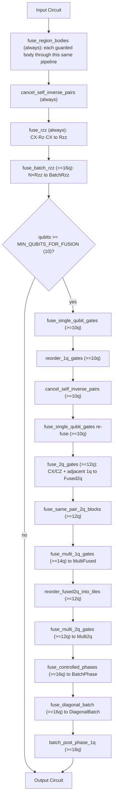

# Fusion Pipeline

Rewrites of the gate stream before execution, each pass gated on a qubit count. The count
is the width of the buffer the backend sweeps, not the circuit's: the density matrix
holds `n` qubits as a `2n`-qubit statevector and so reaches each floor at half the
circuit width (`fuse_circuit_for_width` in `src/circuit/fusion.rs`). Every pass returns
`Cow<Circuit>` and stays `Borrowed` when it changes nothing, so a circuit no pass
touches is never cloned.


```mermaid
flowchart TD
    IN[Input Circuit] --> PR["fuse_region_bodies (always): each guarded body through this same pipeline"]
    PR --> P0["cancel_self_inverse_pairs (always)"]
    P0 --> P0r["fuse_rzz (always): CX&middot;Rz&middot;CX to Rzz"]
    P0r --> P0b["fuse_batch_rzz (>=16q): N&times;Rzz to BatchRzz"]
    P0b --> G{"qubits >= MIN_QUBITS_FOR_FUSION (10)?"}
    G -- no --> OUT[Output Circuit]
    G -- yes --> P1["fuse_single_qubit_gates (>=10q)"]
    P1 --> P1r["reorder_1q_gates (>=10q)"]
    P1r --> P1c["cancel_self_inverse_pairs (>=10q)"]
    P1c --> P1f["fuse_single_qubit_gates re-fuse (>=10q)"]
    P1f --> P2q["fuse_2q_gates (>=12q): CX/CZ + adjacent 1q to Fused2q"]
    P2q --> P2qb["fuse_same_pair_2q_blocks (>=12q)"]
    P2qb --> P2["fuse_multi_1q_gates (>=14q) to MultiFused"]
    P2 --> P2qr["reorder_fused2q_into_tiles (>=12q)"]
    P2qr --> Pm2q["fuse_multi_2q_gates (>=12q) to Multi2q"]
    Pm2q --> Pcp["fuse_controlled_phases (>=16q) to BatchPhase"]
    Pcp --> Pdb["fuse_diagonal_batch (>=16q) to DiagonalBatch"]
    Pdb --> Ppp["batch_post_phase_1q (>=18q)"]
    Ppp --> OUT
```

## Threshold constants

| Constant | Value | Rationale |
|----------|-------|-----------|
| `MIN_QUBITS_FOR_FUSION` | 10 | Below this, clone cost exceeds simulation savings |
| `MIN_QUBITS_FOR_MULTI_FUSION` | 14 | MultiFused tiling overhead vs benefit |
| `MIN_QUBITS_FOR_DIAG_BATCH` | 16 | Diagonal batch, cphase, and Rzz batching |
| `MIN_QUBITS_FOR_POST_PHASE_BATCH` | 18 | Post-phase 1q re-batching |
| `MIN_QUBITS_FOR_2Q_FUSION` | 12 | Benchmarked QV and random sweeps show memory-pass reduction wins from 12q |
| `MIN_QUBITS_FOR_MULTI_2Q_FUSION` | 12 | Same as 2q fusion |

## Payload capacities

The batched gates carry a lookup table sized at compile time, so the pass that emits
them is what keeps the payload inside it. Both caps are declared on the gate payload
(`BatchRzzData::MAX_EDGES`, `BatchPhaseData::MAX_PHASES`) and pinned to the kernel
table shape by a compile-time assertion; the kernels assert on entry in release builds
as well, so a producer that outgrows a table fails loudly instead of dropping work.

| Payload      | Cap        | Producer behavior past the cap                                     |
|--------------|------------|--------------------------------------------------------------------|
| `BatchRzz`   | 32 edges   | `fuse_batch_rzz` splits the run into consecutive batches           |
| `BatchPhase` | 40 entries | `fuse_controlled_phases` splits the chain into consecutive batches |

Splitting is sound because both payloads hold mutually commuting diagonal terms. A
repeated `(control, target)` pair folds into the entry already present. That keeps the
BMI2 and fallback paths in agreement, since the BMI2 kernel indexes one bit per distinct
qubit and a repeated target has no bit of its own, and it bounds a chain by the qubit
count.

`DiagonalBatch` instead declines at the kernel: `build_diagonal_batch_tables` returns
`None` when the grouping does not fit and the backend runs the per-element path.

## Plan capture and replay

A variational sweep holds one gate sequence and varies only the angles. Fusion
decides the same block structure at every point, so `PreparedCircuit` settles it once
and rebinds against it.

The plan is reusable and the matrices are not, since a changed angle changes every fused
matrix it feeds. `FusionPlan` records a recipe per angle-derived payload: a list of
template instructions and how each one's matrix enters the product. Replay recomputes
the products and never caches them. Nested recipes splice by rewriting a
placement flag rather than by materializing the inner product, which is sound because
both widening to a pair and SWAP conjugation are multiplicative.

The passes record this under a `Tracer` that is inactive on the ordinary path, so a
fusion outside the prepared form allocates what it always did.

The plan cannot assume the decisions that read a matrix rather than the gate sequence:

| Decision | Read by | Recorded as |
|----------|---------|-------------|
| A 1q run collapsing to the identity | `flush`, which elides it | `Guard::Fuses1q` |
| A 1q run matching a named gate | `Gate::recognize_matrix` | `Guard::Fuses1q` |
| Whether a 1q block is diagonal | `reorder_1q_gates`, commuting it past a control | `Guard::Fuses1q` |
| Whether a 2q block is diagonal | `PairRun::should_fuse` | `Guard::Diag4q` |

Each guard is re-tested per binding, and a binding that flips one falls back to running
the pipeline, so the stream matches an independently fused circuit either way. The 1q
diagonality guard has to live on the run rather than on a payload site: the block is
often absorbed into a `Fused2q` and keeps no 2x2 of its own, while the reorder it
steered has already happened.

`DiagonalBatch` and `BatchPhase` have no recipe, so a template reaching either declines
capture and re-fuses per binding.

A gate the passes leave untouched still needs a site when it carries an angle. `PauliRot`
holds its angle in a boxed payload rather than in the enum slot, and replay patches it
exactly as it patches an `Rz`; without that site a bound rotation would keep the
template's angle while every other payload moved.

## Fusion cost against apply cost

Fusion cost tracks instruction count and is close to flat in qubit count, while gate
application is `2^n`. For `hardware_efficient_ansatz(n, 5, seed)` on this project's
reference host, fusion is about 22% of a run at 12 qubits and about 0.3% at 20.

```admonish tip
At 16 qubits and above, fusion is not on the hot path, and these passes are tuned for
correctness and clarity rather than for their own runtime. Below that it is worth
amortizing, which is what plan capture exists for.
```
