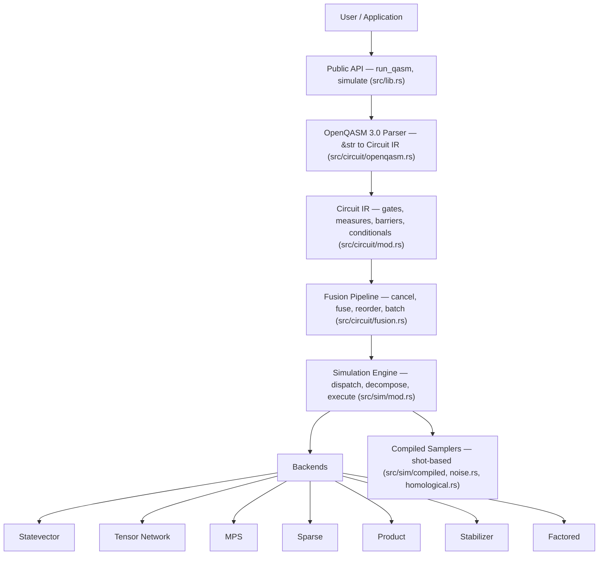

# Architecture: Overview and Layered Design

This section is the technical reference for how PRISM-Q is built. See the
[Glossary](../glossary.md) for definitions of terms used throughout.

## Goals

- **Primary**: Fastest practical quantum circuit simulation in Rust.
- Correct simulation of supported gate sets across multiple backend strategies.
- Clean backend plugin model. New simulation strategies can be added without touching the core.

## Non-goals

- Full OpenQASM 3.0 compliance (supports a practical subset).
- GUI or notebook integration (library-first).
- Hardware backend / QPU connectivity.

## Layered design

A circuit flows top to bottom: text is parsed into a backend-agnostic IR, optimized by
the fusion pipeline, then dispatched by the simulation engine to one of the backends or
a compiled sampler.

The remaining pages in this section follow that flow: the
[parser and circuit IR](./ir.md), the [fusion pipeline](./fusion.md), the
[simulation engine and dispatch](./engine.md), the individual [backends](./backends.md),
the [compiled samplers](./samplers.md), the [native QEC program IR](./qec-ir.md), the
[threading, SIMD, and memory layout](./threading-simd.md), and the
[error model and public API surface](./api-surface.md).
