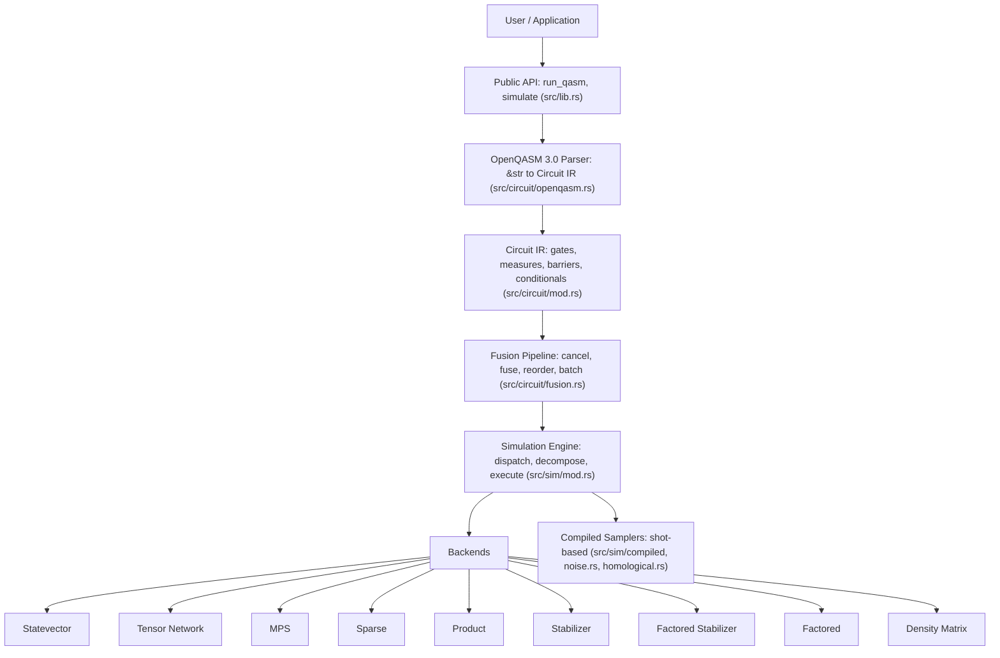

# Architecture: Overview and Layered Design

How PRISM-Q is built. Terms are defined in the [Glossary](../glossary.md).

## Goals

- The fastest practical quantum circuit simulation in Rust, ahead of the other two.
- Correct simulation of the supported gate sets on every backend.
- A backend plugin model, so a new simulation strategy is added without touching the core.

## Non-goals

- Full OpenQASM 3.0 compliance (supports a practical subset).
- GUI or notebook integration (library-first).
- Hardware backend / QPU connectivity.

## Layered design

A circuit flows top to bottom: text is parsed into a backend-agnostic IR, optimized by
the fusion pipeline, then dispatched by the simulation engine to one of the backends or
a compiled sampler.

```mermaid
flowchart TD
    U[User / Application]
    API["Public API: run_qasm, simulate (src/lib.rs)"]
    P["OpenQASM 3.0 Parser: &amp;str to Circuit IR (src/circuit/openqasm.rs)"]
    IR["Circuit IR: gates, measures, barriers, conditionals (src/circuit/mod.rs)"]
    F["Fusion Pipeline: cancel, fuse, reorder, batch (src/circuit/fusion.rs)"]
    E["Simulation Engine: dispatch, decompose, execute (src/sim/mod.rs)"]
    U --> API --> P --> IR --> F --> E
    E --> B[Backends]
    E --> C["Compiled Samplers: shot-based (src/sim/compiled, noise.rs, homological.rs)"]
    B --> SV[Statevector]
    B --> TN[Tensor Network]
    B --> MPS[MPS]
    B --> SP[Sparse]
    B --> PR[Product]
    B --> ST[Stabilizer]
    B --> FS[Factored Stabilizer]
    B --> FA[Factored]
    B --> DM[Density Matrix]
```

The pages in this section follow that flow: the
[parser and circuit IR](./ir.md), the [fusion pipeline](./fusion.md), the
[simulation engine and dispatch](./engine.md), the individual [backends](./backends.md),
the [compiled samplers](./samplers.md), the [native QEC program IR](./qec-ir.md) and its
[execution path](./qec-programs.md), the
[threading, SIMD, and memory layout](./threading-simd.md), and the
[error model and public API surface](./api-surface.md).
