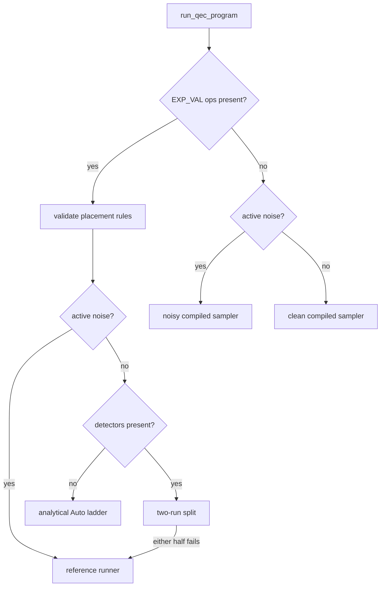

# QEC Program Execution

This page covers the execution architecture behind native QEC programs: the
runner routing, the compiled row machinery, the circuit lowerings, the noisy
data flow, the expectation-value estimator paths, and the result shape. The
data model and text format are defined in the
[native QEC program IR](./qec-ir.md) page; workflow examples live in the
[noise and QEC guide](../guides/qec.md). The public entry points are
`run_qec_program`, `run_qec_program_reference`,
`run_qec_program_with_strategy`, `run_qec_program_spd_rerouted`, and
`compile_qec_program_rows`.

## Program, ops, and options

`QecProgram` holds a qubit count, an ordered op list, and a `QecOptions`
value. The typed builders (`push_gate`, `measure`, `measure_pauli_product`,
`reset`, `detector`, `observable_include`, `expectation_value`, `postselect`,
`noise`) validate each op as it is appended; `measure` and
`measure_pauli_product` return the new measurement-record index, and
`detector` returns the detector index. Validation covers gate arity, qubit
bounds, finite coordinates, coefficients, and probabilities, record-reference
scope, duplicate qubits in a Pauli product, and `DEPOLARIZE2` target pairing.

| `QecOp` variant | Payload | Semantics |
| --- | --- | --- |
| `Gate` | `gate`, `targets` | Standard gate. The compiled runner requires Clifford gates; the reference runner accepts any gate the statevector backend supports. |
| `Measure` | `basis`, `qubit` | Single-qubit measurement in the requested basis. One record. |
| `MeasurePauliProduct` | `terms` | One record equal to the parity of the listed Pauli terms. |
| `Reset` | `basis`, `qubit` | Reset to the `+1` eigenstate of the requested basis. |
| `Detector` | `records`, `coords` | Parity over the listed records. `coords` is passthrough metadata with no effect on sampling. |
| `ObservableInclude` | `observable`, `records` | Includes for the same observable index XOR into a single row. |
| `ExpectationValue` | `terms`, `coefficient` | `coefficient * <P>` in the final state. Terminal placement, live qubits only. |
| `Postselect` | `records`, `expected` | The shot is accepted only when the parity over `records` matches `expected`. |
| `Noise` | `channel`, `targets` | Pauli-noise annotation. Zero probability is inactive. |
| `Tick` | | Scheduling separator with no semantic effect. |

Record references are `QecRecordRef::Absolute` indices or
`QecRecordRef::Lookback` distances (distance 1 is the most recent record,
distance 0 is rejected), resolved against the records that exist when the
referencing op is appended. The text parser resolves `rec[-k]` references to
absolute indices while parsing.

| `QecOptions` field | Default | Effect |
| --- | --- | --- |
| `shots` | `1024` | Number of shots requested by the runner APIs. |
| `seed` | `42` | RNG seed for stochastic samplers and Pauli-noise dispatch. |
| `chunk_size` | `None` | Per-batch shot bound for the compiled runner. `None` is equivalent to `Some(shots)`; `Some(0)` is rejected. No effect on the reference runner. |
| `keep_measurements` | `true` | When `false`, `QecSampleResult::measurements` is returned with zero shots (column count preserved). Detector and observable records are always populated. |

## Runner routing

`run_qec_program` picks one of five paths:



Programs containing `EXP_VAL` ops are routed instead of packed-sampled. The
placement rules are validated first, then active noise sends the program to
`run_qec_program_reference`, detectors send it to the two-run split, and the
remaining noiseless case runs the analytical Auto ladder described under
Expectation values.

Programs without `EXP_VAL` ops take the packed compiled path. Validation
rejects non-Clifford gates and reports whether active noise is present.
Programs with no measurements return an empty record buffer without compiling
a sampler. Noisy Clifford programs compile a noise-aware sampler; clean
Clifford programs lower to a circuit and compile a detector sampler. Both
honor `QecOptions::chunk_size`: sampling proceeds in batches of at most
`chunk_size` shots, and detector, observable, postselection, and
logical-error accounting runs per chunk, so peak memory stays at one chunk of
measurement records when raw measurements are not kept.

The two-run split serves noiseless `EXP_VAL` programs with detectors.
Detectors are record metadata with no effect on the state, so the halves
compose: the packed sampler runs the program without its `EXP_VAL` ops
(real sampled measurement, detector, and observable records), and the
analytical ladder runs the program without its detectors (exact estimates
attached to the sampled result). When either half cannot run, for example
non-Clifford gates on the packed half, the whole program falls back to the
reference runner.

`run_qec_program_reference` is the correctness oracle: one statevector
simulation per shot, `O(shots * 2^n)`. It executes ops in order, samples
Pauli noise stochastically from a dedicated RNG stream derived from the seed,
lowers `MPP` onto one scratch qubit at index `num_qubits`, and evaluates
postselection parities per shot.

## Compiled rows

`compile_qec_program_rows` is the public sampler-row primitive. It lowers
basis measurements and `MPP` ops into `QecCompiledRows`: one packed X/Z Pauli
row per measurement record (bitmask words over the qubits), plus detector,
observable, and postselection rows carried as absolute record indices with
their expected values. Parity projection delegates to
`PackedShots::parity_rows`, so the QEC layer reuses the packed parity engine
of the compiled sampler. The row compiler is a lowering artifact, not an
execution path: it rejects programs containing gates, resets, active noise,
or `EXP_VAL`.

The clean compiled path builds its sampler from the lowered Clifford circuit
instead. The compiled sampler backward-propagates each measurement observable
through the circuit into a Pauli sensitivity row, reduces the rows by
Gaussian elimination into a set of independent flip rows plus a deterministic
reference outcome, and samples shots by XORing a random subset of flip rows
into the reference bits. Detector and observable rows are applied afterward
as parities over the sampled records. The propagation and sampling machinery
is described on the [compiled samplers](./samplers.md) page.

## Lowering

Two lowerings turn a QEC program into a circuit the samplers accept, sharing
the same helpers for basis rotations (`append_basis_to_z_rotation` and its
inverse), `MPP` parity accumulation (`append_mpp_parity_rotations`: rotate
each term into the Z basis, accumulate parity on a scratch qubit via `CX`,
undo the rotations, measure the scratch), and a final record-count check that
the lowering emitted exactly `num_measurements` records.

The clean Clifford lowering emits measurements in place: rotate the measured
qubit into the Z basis, measure into the next record, rotate back. `MPP` uses
one scratch qubit at index `num_qubits`, reset between uses. Resets emit a
reset followed by the basis rotation.

The deferred lowering backs the noisy path and the analytical estimator
prelude. A reset assigns the program qubit a fresh circuit alias, so every
measurement can be deferred to a terminal record of the lowered circuit;
reusing a measured qubit without a reset is rejected. The final alias of each
program qubit is recorded so terminal `EXP_VAL` terms translate onto the
lowered circuit. Noise ops are not applied to the circuit; they are recorded
as positioned events for sensitivity compilation.

```admonish note title="V1 reset requirement"
A measured qubit must be reset before any later gate reuses it, because the
compiled lowering defers measurements to terminal records.
`QecOptions::chunk_size` bounds compiled-runner shot batches. When raw
measurements are omitted, chunking avoids materializing the full
measurement-record matrix before detector, observable, postselection, and
logical-error accounting.
```

## Noisy data flow

Noise never executes during compiled sampling; it compiles into record flips.

At compile time, the deferred lowering produces the noiseless circuit plus
the positioned noise events. Backward Pauli propagation then walks the
circuit in reverse, carrying each measurement's observable to each event
position, and converts every event into sensitivity rows: for each noise
branch, the set of measurement records whose propagated Pauli anti-commutes
with the injected error, packed as flip masks. The noiseless sampler is
compiled on the deferred circuit.

At sample time, the noiseless records are sampled first, then each noise
event stochastically XORs its branch flip masks into the shot-major record
buffer from a noise RNG stream derived from the seed. Small-probability
events skip between firing shots with geometric sampling; dense events
(probability at or above `0.5`, or fewer than 32 shots) iterate every shot.
`DEPOLARIZE2` precomputes the flip masks of all 15 non-identity two-qubit
Pauli branches and picks one uniformly per firing.

Supported channels are `X_ERROR`, `Z_ERROR`, `DEPOLARIZE1`, and
`DEPOLARIZE2`. Noise on an already-measured target is dropped (it can no
longer affect any record), and a `DEPOLARIZE2` pair with one measured target
degrades to `DEPOLARIZE1` at `p * 0.8` on the survivor, preserving the
marginal error rate. The reference runner instead applies the same channels
stochastically to the per-shot state. How the QEC noise path relates to the
circuit-level noisy engines is covered by the noisy engine routing section of
the [compiled samplers](./samplers.md) page.

## Expectation values

`EXP_VAL(c) P1*...*Pk` estimates `c * <P>` for the Pauli product `P` in the
program's final state and returns one `QecObservableEstimate` per op, in op
order, in `QecSampleResult::expectation_values`. Two placement rules make
"final state" well defined on every path:

- Terminal placement: no gate, measurement, reset, or active noise may follow
  an `EXP_VAL` op. Detector, observable, postselection, and tick metadata
  may.
- Live qubits only: a term may not reference a qubit that was
  single-qubit-measured after its last reset. Under this rule the Pauli
  commutes with every prior measurement projector, so the sampled
  post-measurement average equals the measurement-stripped pure-state
  expectation the analytical strategies compute. `MPP` does not affect
  liveness: the deferred lowering measures a scratch alias, and the projected
  cross terms cancel exactly.

Estimator paths:

| Path | Selection | `mean` | `variance` |
| --- | --- | --- | --- |
| Reference runner | `run_qec_program` with active noise, or as the detector-split fallback; `run_qec_program_reference` directly | per-shot exact `c * <P>` averaged over accepted shots | unbiased sample variance |
| Analytical ladder (SPD, CAMPS, tensor network) | `run_qec_program` noiseless; `run_qec_program_with_strategy` | exact `c * <P>` on the lowered unitary | `c^2 *` squared SPD truncation weight; `0.0` for CAMPS and tensor network |

The reference runner precomputes Pauli masks per observable and evaluates
`c * <P>` on the final statevector of every accepted shot, reporting the
sample mean and unbiased sample variance with `num_shots` equal to the
accepted count. Programs wider than 64 qubits (including the `MPP` scratch
qubit) are rejected, since the mask reduction packs X and Z masks into
64-bit words. With noise annotations the per-shot trajectories average to
the mixed-state expectation `Tr(rho P)`.

The analytical strategies evaluate `<0|U^dag P U|0>` on the deferred lowering
with the trailing measurements stripped, translating record observables into
Z strings and `EXP_VAL` terms through the final qubit aliases. They reject
detectors and active noise; `run_qec_program` composes those cases through
the split and reference routes instead. `QecTStrategy` selects the path:

- `Auto`, the production ladder. Light-cone SPD runs first (truncation
  tolerance `1e-10`, term cap `16384`) and its result is accepted when every
  estimate reports no truncation; SPD encodes truncation as
  `variance = total_discarded^2`, and variance at or below `1e-12` counts as
  exact. Otherwise CAMPS runs (bond dimension cap `256`), which hard-errors
  when SVD truncation discards weight above `1e-12` so the ladder falls
  through to the exact tensor-network scalar fallback. When all three fail,
  the combined error reports each stage's reason.
- `Reference`, the per-shot oracle.
- `Spd` and `Camps` run their stage directly.

CAMPS evaluates arbitrary X/Y/Z strings by conjugating each letter through
the signed Clifford prefix (`Y = i * X * Z` composes the two inverse-tableau
rows). Postselection composes on both paths: the reference runner averages
over accepted shots, and the analytical combiner conditions via
`<O * Pi> / <Pi>` evaluated over the projector subsets, capped at 12
postselection predicates; the projector Z strings live on measured aliases
and so never overlap `EXP_VAL` terms.

`run_qec_program_spd_rerouted` accepts caller-supplied Z stabilizers per
observable and evaluates each rerouted observable on the XOR-equivalent
support with the smallest inverse light cone, verifying first (via SPD) that
the substituted stabilizer product holds `<S> = +1` in the lowered state;
observables without a reroute evaluate on their original support. The path
rejects `EXP_VAL` ops, postselection, and resets (resets relabel qubits,
making stabilizer indices ambiguous).

Routing and placement are pinned by `tests/qec_exp_val.rs`;
`tests/qec_e2e_d3.rs` checks distance-3 repetition-code fixtures against
closed-form expectations on the compiled, analytical, and reference paths.

## Result shape

Every runner returns a `QecSampleResult`. The type is `#[non_exhaustive]`:
construct through `new`, `new_with_total_shots`, or `empty`, and match fields
with a trailing `..`.

| Field | Meaning |
| --- | --- |
| `total_shots` | Shots requested. `accepted_shots + discarded_shots == total_shots`. |
| `measurements` | Raw measurement records, or a zero-shot buffer when `keep_measurements` is `false` (column count preserved). |
| `detectors` | One bit per detector per shot. |
| `observables` | One bit per observable per shot. Synthesized on the analytical path (below). |
| `accepted_shots` | Shots accepted after postselection (`total_shots` without a predicate). |
| `discarded_shots` | Shots rejected by postselection. |
| `logical_errors` | Per observable, the count of accepted shots whose parity is 1. |
| `observable_expectations` | Optional weighted-estimator expectation per observable; `None` when the strategy emits raw bit counts only. |
| `expectation_values` | Estimates for the program's `EXP_VAL` ops, one per op in op order, coefficient-scaled; `None` when the program has none. |

`QecObservableEstimate` carries `mean`, `variance`, and `num_shots` (the
shots that contributed, excluding postselection rejections). Zero accepted
shots yield `{mean: 0.0, variance: 0.0, num_shots: 0}`.

Analytical strategies have no per-shot stream, so they synthesize the packed
`observables` records to match the `logical_errors` counts: the one-bits
occupy positions `[0, accepted_shots)` and the remainder is inert padding.
Derive rates with `logical_error_rates` (denominator `accepted_shots`); do
not align these rows shot-for-shot with detector rows on the analytical
path.

Record buffers reuse the measurement-major `PackedShots` layout of the
compiled sampler: one contiguous bit row per record across all shots, shot
`j` at bit `j % 64` of word `j / 64`. Detector, observable, and
postselection parities XOR whole shot words of the referenced measurement
rows. Summary statistics are available as `survivor_rate`,
`logical_error_rates`, and their Wilson-interval variants.
