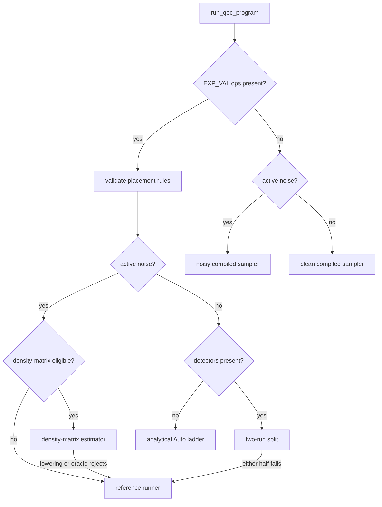

# QEC Program Execution

This page covers the execution architecture behind native QEC programs: the
runner routing, the compiled row machinery, the circuit lowerings, the noisy
data flow, the expectation-value estimator paths, and the result shape. The
data model and text format are defined in the
[native QEC program IR](./qec-ir.md) page; workflow examples live in the
[noise and QEC guide](../guides/qec.md). The public entry points are
`run_qec_program`, `run_qec_program_reference`,
`run_qec_program_with_strategy`, `run_qec_program_spd_rerouted`, and
`compile_qec_program_rows`.

## Program, ops, and options

`QecProgram` holds a qubit count, an ordered op list, and a `QecOptions`
value. The typed builders (`push_gate`, `measure`, `measure_pauli_product`,
`reset`, `detector`, `observable_include`, `expectation_value`, `postselect`,
`noise`) validate each op as it is appended; `measure` and
`measure_pauli_product` return the new measurement-record index, and
`detector` returns the detector index. Validation covers gate arity, qubit
bounds, finite coordinates, coefficients, and probabilities, record-reference
scope, duplicate qubits in a Pauli product, and `DEPOLARIZE2` target pairing.

| `QecOp` variant | Payload | Semantics |
| --- | --- | --- |
| `Gate` | `gate`, `targets` | Standard gate. The compiled runner requires Clifford gates; the reference runner accepts any gate the statevector backend supports. |
| `Measure` | `basis`, `qubit` | Single-qubit measurement in the requested basis. One record. The qubit is left in the Z frame: the basis rotation is not undone. Reset it before a later operation reuses it. |
| `MeasurePauliProduct` | `terms` | One record equal to the parity of the listed Pauli terms. Unlike `Measure`, the per-term basis rotations are undone before the record is taken. |
| `Reset` | `basis`, `qubit` | Reset to the `+1` eigenstate of the requested basis. |
| `Detector` | `records`, `coords` | Parity over the listed records. `coords` is passthrough metadata with no effect on sampling. |
| `ObservableInclude` | `observable`, `records` | Includes for the same observable index XOR into a single row. |
| `ExpectationValue` | `terms`, `coefficient` | `coefficient * <P>` in the final state. Terminal placement, live qubits only. |
| `Postselect` | `records`, `expected` | The shot is accepted only when the parity over `records` matches `expected`. |
| `Noise` | `channel`, `targets` | Pauli-noise annotation. Zero probability is inactive. |
| `Tick` | | Scheduling separator with no semantic effect. |

Record references are `QecRecordRef::Absolute` indices or
`QecRecordRef::Lookback` distances (distance 1 is the most recent record,
distance 0 is rejected), resolved against the records that exist when the
referencing op is appended. The text parser resolves `rec[-k]` references to
absolute indices while parsing.

| `QecOptions` field | Default | Effect |
| --- | --- | --- |
| `shots` | `1024` | Number of shots requested by the runner APIs. |
| `seed` | `42` | RNG seed for stochastic samplers and Pauli-noise dispatch. |
| `chunk_size` | `None` | Per-batch shot bound for the compiled runner. `None` is equivalent to `Some(shots)`; `Some(0)` is rejected. No effect on the reference runner. |
| `keep_measurements` | `true` | When `false`, `QecSampleResult::measurements` is returned with zero shots (column count preserved). Detector and observable records are always populated. |

## Runner routing

`run_qec_program` picks one of six paths:



Programs containing `EXP_VAL` ops are routed instead of packed-sampled. The
placement rules are validated first, then active noise sends the program to
the density-matrix estimator or `run_qec_program_reference`, detectors send it
to the two-run split, and the remaining noiseless case runs the analytical
Auto ladder described under Expectation values.

Programs without `EXP_VAL` ops take the packed compiled path. Validation
rejects non-Clifford gates and reports whether active noise is present.
Programs with no measurements return an empty record buffer without compiling
a sampler. Noisy Clifford programs compile a noise-aware sampler; clean
Clifford programs lower to a circuit and compile a detector sampler. Both
honor `QecOptions::chunk_size`: sampling proceeds in batches of at most
`chunk_size` shots, and detector, observable, postselection, and
logical-error accounting runs per chunk, so peak memory stays at one chunk of
measurement records when raw measurements are not kept.

The two-run split serves noiseless `EXP_VAL` programs with detectors.
Detectors are record metadata with no effect on the state, so the halves
compose: the packed sampler runs the program without its `EXP_VAL` ops
(real sampled measurement, detector, and observable records), and the
analytical ladder runs the program without its detectors (exact estimates
attached to the sampled result). When either half cannot run, for example
non-Clifford gates on the packed half, the whole program falls back to the
reference runner.

The density-matrix estimator serves noisy `EXP_VAL` programs whose noisy
ensemble the mixed state can carry in full, where `Tr(rho P)` is the exact
value the reference runner approximates by averaging per-shot statevector
expectations. Eligibility:

- No measurement records. `M` and `MPP` collapse the state per shot and feed
  the measurement, detector, and observable rows of the result; the mixed
  state holds no record stream, so those programs need real sampling.
- No postselection predicate, which would condition the estimate on an
  accepted subensemble that `Tr(rho P)` does not express.
- Width within the density-matrix cap (`PRISM_MAX_DM_QUBITS`, default half
  the statevector cap), since the backend stores `4^n` amplitudes.

`R` is eligible. Both paths implement the reset channel
`rho -> |0><0| (x) tr_q rho` per the reset contract on the
[backends](./backends.md) page: the density matrix applies it directly, and
the reference runner samples one trajectory of it per shot, so the shot mean
still converges to `Tr(rho P)`.

Gates and channels the density-matrix path rejects surface as an error from
the lowering or the oracle, which also falls back to the reference runner. The
lowering maps gates one to one, expands a basis reset into `Reset` plus its
Z-to-basis rotation, and turns each Pauli-noise annotation into `NoiseModel`
events on the instruction it follows, applied through the backend's exact
one-qubit Kraus and two-qubit depolarizing channels.

`run_qec_program_reference` is the correctness oracle: one statevector
simulation per shot, `O(shots * 2^n)`. It executes ops in order, samples
Pauli noise stochastically from a dedicated RNG stream derived from the seed,
lowers `MPP` onto one scratch qubit at index `num_qubits`, and evaluates
postselection parities per shot.

## Compiled rows

`compile_qec_program_rows` is the public sampler-row primitive. It lowers
basis measurements and `MPP` ops into `QecCompiledRows`: one packed X/Z Pauli
row per measurement record (bitmask words over the qubits), plus detector,
observable, and postselection rows carried as absolute record indices with
their expected values. Parity projection delegates to
`PackedShots::parity_rows`, so the QEC layer reuses the packed parity engine
of the compiled sampler. The row compiler is a lowering artifact, not an
execution path: it rejects programs containing gates, resets, active noise,
or `EXP_VAL`.

The clean compiled path builds its sampler from the lowered Clifford circuit
instead. The compiled sampler backward-propagates each measurement observable
through the circuit into a Pauli sensitivity row, reduces the rows by
Gaussian elimination into a set of independent flip rows plus a deterministic
reference outcome, and samples shots by XORing a random subset of flip rows
into the reference bits. Detector and observable rows are applied afterward
as parities over the sampled records. The propagation and sampling machinery
is described on the [compiled samplers](./samplers.md) page.

## Lowering

Two lowerings turn a QEC program into a circuit the samplers accept, sharing
the same helpers for basis rotations (`append_basis_to_z_rotation` and its
inverse), `MPP` parity accumulation (`append_mpp_parity_rotations`: rotate
each term into the Z basis, accumulate parity on a scratch qubit via `CX`,
undo the rotations, measure the scratch), and a final record-count check that
the lowering emitted exactly `num_measurements` records.

The clean Clifford lowering emits measurements in place: rotate the measured
qubit into the Z basis, measure into the next record, rotate back. `MPP` uses
one scratch qubit at index `num_qubits`, reset between uses. Resets emit a
reset followed by the basis rotation.

The deferred lowering backs the noisy path and the analytical estimator
prelude. A reset assigns the program qubit a fresh circuit alias, so every
measurement can be deferred to a terminal record of the lowered circuit;
reusing a measured qubit without a reset is rejected. The final alias of each
program qubit is recorded so terminal `EXP_VAL` terms translate onto the
lowered circuit. Noise ops are not applied to the circuit; they are recorded
as positioned events for sensitivity compilation.

```admonish note title="V1 reset requirement"
A measured qubit must be reset before any later gate reuses it, because the
compiled lowering defers measurements to terminal records.
`QecOptions::chunk_size` bounds compiled-runner shot batches. When raw
measurements are omitted, chunking avoids materializing the full
measurement-record matrix before detector, observable, postselection, and
logical-error accounting.
```

## Noisy data flow

Noise never executes during compiled sampling; it compiles into record flips.

At compile time, the deferred lowering produces the noiseless circuit plus
the positioned noise events. Backward Pauli propagation then walks the
circuit in reverse, carrying each measurement's observable to each event
position, and converts every event into sensitivity rows: for each noise
branch, the set of measurement records whose propagated Pauli anti-commutes
with the injected error, packed as flip masks. The noiseless sampler is
compiled on the deferred circuit.

At sample time, the noiseless records are sampled first, then each noise
event stochastically XORs its branch flip masks into the shot-major record
buffer from a noise RNG stream derived from the seed. Small-probability
events skip between firing shots with geometric sampling; dense events
(probability at or above `0.5`, or fewer than 32 shots) iterate every shot.
`DEPOLARIZE2` precomputes the flip masks of all 15 non-identity two-qubit
Pauli branches and picks one uniformly per firing.

Supported channels are `X_ERROR`, `Z_ERROR`, `DEPOLARIZE1`, and
`DEPOLARIZE2`. Noise on an already-measured target is dropped (it can no
longer affect any record), and a `DEPOLARIZE2` pair with one measured target
degrades to `DEPOLARIZE1` at `p * 0.8` on the survivor, preserving the
marginal error rate. The reference runner instead applies the same channels
stochastically to the per-shot state, and the density-matrix estimator
applies them exactly: `X_ERROR` and `Z_ERROR` become one-axis Pauli channels,
`DEPOLARIZE1` a symmetric one-qubit depolarizing channel, and `DEPOLARIZE2` a
two-qubit depolarizing channel on each target pair. How the QEC noise path
relates to the circuit-level noisy engines is covered by the noisy engine
routing section of the [compiled samplers](./samplers.md) page.

## Detector error model export

`QecProgram::detector_error_model` derives a `DetectorErrorModel`: the set of
independent error mechanisms implied by the program's noise annotations,
detectors, and observables. Matching and belief-propagation decoders consume
this model rather than raw detector samples.

The derivation reuses the noisy data flow above. The deferred lowering
produces the noiseless circuit and the positioned noise events, and the same
backward Pauli propagation supplies, at every event position, the set of
measurement records each single-Pauli fault flips. Every annotation then
expands into its fault branches (one per target for `X_ERROR` and `Z_ERROR`,
three per target for `DEPOLARIZE1`, fifteen per pair for `DEPOLARIZE2`), and
each branch's record mask is projected through the detector and observable
rows to its symptom: the detectors and observables it flips.

Branches merge into mechanisms under two rules, at fault-site granularity
(one target of a single-qubit annotation, or one target pair of
`DEPOLARIZE2`):

- Branches at one fault site are mutually exclusive, so branches with the
  same symptom sum. A `DEPOLARIZE1` site whose X and Y branches flip the same
  records yields one mechanism at exactly `2p/3`.
- Distinct fault sites are independent, distinct targets of one annotation
  included, so mechanisms with the same symptom compose as
  `p = p1(1-p2) + p2(1-p1)`.

Faults that flip no detector and no observable are omitted. Mechanisms keep
program order (the position of the annotation that first produced each
symptom). Mechanisms are independent in the model even where the underlying
branches were exclusive, so model statistics agree with the sampler to second
order in the branch probabilities; validation compares at tolerances, never
exactly.

Consequences of the sampler semantics carry over unchanged: a measurement
error argument (`M(p)`) is already a pre-measurement Pauli fault, so it
appears as an ordinary mechanism on that record's detectors; noise on an
already-measured qubit contributes nothing; and a `DEPOLARIZE2` pair with one
measured target enters as the exact `DEPOLARIZE1(0.8p)` marginal on the
survivor. Non-Clifford gates and reuse of a measured qubit without reset are
rejected, as on the compiled sampling path.

Hypergraph mechanisms (more than two detectors, as `DEPOLARIZE2` produces)
stay intact in the derived model; decoders that accept a check matrix consume
them directly. A matching decoder needs the graphlike form, which is opt-in:
`decompose_graphlike` returns a new model in which every hypergraph mechanism
is replaced by two or more existing graphlike mechanisms whose non-empty
detector sets partition its detectors and whose observable XOR matches it,
with the mechanism's probability composed into every component. A `DEPOLARIZE2`
`Y`-`Y` branch, for example, splits into the same channel's single-qubit
branches. Cross-component correlations are lost; single-detector marginals are
unchanged, since each hyperedge composes into exactly one component containing
any given detector. A mechanism with no such cover is an error naming its
symptom; decomposition is never applied silently, and the writer serializes
whichever model it is given.

### Text format

`DetectorErrorModel::to_text` renders the model in the common detector error
model text format that external matching and belief-propagation decoders
read. The emitted subset:

```text
error(<p>) D<i> ... L<j> ...
detector D<i>
detector(<c0>, <c1>, ...) D<i>
logical_observable L<j>
```

One `error` line per mechanism in mechanism order, carrying its probability
and the `D`-prefixed detector indices and `L`-prefixed observable indices it
flips, both ascending. One `detector` line per detector in index order, with
the coordinates of the program's detector op when present. One
`logical_observable` line per observable slot. Indices are zero-based and
dense; probabilities print with enough digits to round-trip exactly. Flat
models only: no repeat blocks, no coordinate shifts, no decomposition
suggestions.

Example, one syndrome round of the three-qubit repetition memory under
`X_ERROR(0.05)` on the data qubits:

```text
error(0.05) D0
error(0.05) D0 D1
error(0.05) D1
detector D0
detector D1
```

In Python, `QecProgram.detector_error_model()` returns the model with
`probabilities()` (float64), `detector_matrix()` and `observable_matrix()`
(bool, detectors or observables by mechanisms), `detector_coords()`, and
`to_text()`. The matrix triple feeds check-matrix decoder constructors
directly, with no file in between.

### Decoding

`UnionFindDecoder` closes the pipeline in-tool: sample, derive, decompose,
decode, logical error rate, one API. The decoder family is union-find with
peeling (Delfosse and Nickerson, arXiv:1709.06218), chosen for its
almost-linear decode cost; a minimum-weight perfect matching decoder remains a
possible second family behind the same model input if accuracy on hard
workloads ever justifies its cost.

`UnionFindDecoder::from_model` compiles a graphlike model: detectors become
vertices, a two-detector mechanism an internal edge, a one-detector mechanism
a boundary edge, each weighted `ln((1-p)/p)` clamped at zero. A mechanism with
more than two detectors is rejected with a pointer to `decompose_graphlike`.
Mechanisms flipping no detector cannot enter the graph; their probability mass
is a floor under the logical error rate of any decoder over the model.
Mechanisms sharing one detector set collapse to the most probable of them, and
the mass of single faults this misroutes is measured (not assumed away) by the
enumeration tests in `tests/qec_decoder.rs`.

`decode_packed` maps a `PackedShots` of detector samples (either layout) to
shot-major predicted observable flips, one bit per observable per shot. Per
shot, clusters grow from the defects in the `ln((1-p)/p)` metric: each round
adds the minimum slack over the active clusters' unsaturated incident edges,
so at least one edge saturates per round; a cluster becomes inactive when its
parity is even or it touches a boundary edge. Peeling then walks a spanning
forest of each grown cluster, rooted at the boundary contact when one exists,
and XORs the observable mask of every selected edge into the prediction. A
component with odd parity and no boundary edge is impossible under the model
and rejects the batch, naming the shot. Decoding is deterministic: no
randomness anywhere, ties break by ascending edge index in mechanism order,
and results are identical on the serial and Rayon paths. Shots are
independent: under the `parallel` feature, batches of at least 1024 shots
decode in parallel over 256-shot chunks with per-chunk scratch reuse and no
per-shot allocation; a model with no observables decodes serially at any
batch size.

Validation ties the decoder to the exact ML lookup rate: at distance 3 the
full syndrome set is enumerable, so the tests compute the exact expected
union-find failure rate alongside the exact ML rate and assert
`rate_ML <= rate_UF <= P(two or more faults) + measured single-fault misses`,
pin the analytic rate at 1e-12, and hold fixed-seed golden decode counts. On
repetition memory at p=0.02 (20k shots, seed 42, 3 rounds) the decoded rate
falls from distance 3 to distance 5 and both sit below the physical rate.
Python exposes the same surface as `Decoder(model)` with
`decode(detectors) -> (shots, num_observables)` over numpy bool arrays.

## Expectation values

`EXP_VAL(c) P1*...*Pk` estimates `c * <P>` for the Pauli product `P` in the
program's final state and returns one `QecObservableEstimate` per op, in op
order, in `QecSampleResult::expectation_values`. Two placement rules make
"final state" well defined on every path:

- Terminal placement: no gate, measurement, reset, or active noise may follow
  an `EXP_VAL` op. Detector, observable, postselection, and tick metadata
  may.
- Live qubits only: a term may not reference a qubit that was
  single-qubit-measured after its last reset. Under this rule the Pauli
  commutes with every prior measurement projector, so the sampled
  post-measurement average equals the measurement-stripped pure-state
  expectation the analytical strategies compute. `MPP` does not affect
  liveness: the deferred lowering measures a scratch alias, and the projected
  cross terms cancel exactly.

Estimator paths:

| Path | Selection | `mean` | `variance` |
| --- | --- | --- | --- |
| Density-matrix estimator | `run_qec_program` with active noise on an eligible program | exact `c * Tr(rho P)` | `0.0` |
| Reference runner | `run_qec_program` with active noise on an ineligible program, or as the detector-split fallback; `run_qec_program_reference` directly | per-shot exact `c * <P>` averaged over accepted shots | unbiased sample variance |
| Analytical ladder (SPD, CAMPS, tensor network) | `run_qec_program` noiseless; `run_qec_program_with_strategy` | exact `c * <P>` on the lowered unitary | `c^2 *` squared SPD truncation weight; `0.0` for CAMPS and tensor network |

The reference runner precomputes Pauli masks per observable and evaluates
`c * <P>` on the final statevector of every accepted shot, reporting the
sample mean and unbiased sample variance with `num_shots` equal to the
accepted count. Programs wider than 64 qubits (including the `MPP` scratch
qubit) are rejected, since the mask reduction packs X and Z masks into
64-bit words. With noise annotations the per-shot trajectories average to
the mixed-state expectation `Tr(rho P)`.

The analytical strategies evaluate `<0|U^dag P U|0>` on the deferred lowering
with the trailing measurements stripped, translating record observables into
Z strings and `EXP_VAL` terms through the final qubit aliases. They reject
detectors and active noise; `run_qec_program` composes those cases through
the split and reference routes instead. `QecTStrategy` selects the path:

- `Auto`, the production ladder. Light-cone SPD runs first (truncation
  tolerance `1e-10`, term cap `16384`) and its result is accepted when every
  estimate reports no truncation; SPD encodes truncation as
  `variance = total_discarded^2`, and variance at or below `1e-12` counts as
  exact. Otherwise CAMPS runs (bond dimension cap `256`), which hard-errors
  when SVD truncation discards weight above `1e-12` so the ladder falls
  through to the exact tensor-network scalar fallback. When all three fail,
  the combined error reports each stage's reason.
- `Reference`, the per-shot oracle.
- `Spd` and `Camps` run their stage directly.

CAMPS evaluates arbitrary X/Y/Z strings by conjugating each letter through
the signed Clifford prefix (`Y = i * X * Z` composes the two inverse-tableau
rows). Postselection composes on both paths: the reference runner averages
over accepted shots, and the analytical combiner conditions via
`<O * Pi> / <Pi>` evaluated over the projector subsets, capped at 12
postselection predicates; the projector Z strings live on measured aliases
and so never overlap `EXP_VAL` terms.

`run_qec_program_spd_rerouted` accepts caller-supplied Z stabilizers per
observable and evaluates each rerouted observable on the XOR-equivalent
support with the smallest inverse light cone, verifying first (via SPD) that
the substituted stabilizer product holds `<S> = +1` in the lowered state;
observables without a reroute evaluate on their original support. The path
rejects `EXP_VAL` ops, postselection, and resets (resets relabel qubits,
making stabilizer indices ambiguous).

Routing and placement are pinned by `tests/qec_exp_val.rs`;
`tests/qec_e2e_d3.rs` checks distance-3 repetition-code fixtures against
closed-form expectations on the compiled, analytical, and reference paths.

## Result shape

Every runner returns a `QecSampleResult`. The type is `#[non_exhaustive]`:
construct through `new`, `new_with_total_shots`, or `empty`, and match fields
with a trailing `..`.

| Field | Meaning |
| --- | --- |
| `total_shots` | Shots requested. `accepted_shots + discarded_shots == total_shots`. |
| `measurements` | Raw measurement records, or a zero-shot buffer when `keep_measurements` is `false` (column count preserved). |
| `detectors` | One bit per detector per shot. |
| `observables` | One bit per observable per shot. Synthesized on the analytical path (below). |
| `accepted_shots` | Shots accepted after postselection (`total_shots` without a predicate). |
| `discarded_shots` | Shots rejected by postselection. |
| `logical_errors` | Per observable, the count of accepted shots whose parity is 1. |
| `observable_expectations` | Optional weighted-estimator expectation per observable; `None` when the strategy emits raw bit counts only. |
| `expectation_values` | Estimates for the program's `EXP_VAL` ops, one per op in op order, coefficient-scaled; `None` when the program has none. |

`QecObservableEstimate` carries `mean`, `variance`, and `num_shots` (the
shots that contributed, excluding postselection rejections). Zero accepted
shots yield `{mean: 0.0, variance: 0.0, num_shots: 0}`.

Analytical strategies have no per-shot stream, so they synthesize the packed
`observables` records to match the `logical_errors` counts: the one-bits
occupy positions `[0, accepted_shots)` and the remainder is inert padding.
Derive rates with `logical_error_rates` (denominator `accepted_shots`); do
not align these rows shot-for-shot with detector rows on the analytical
path.

The compiled runner delivers shot-major `PackedShots` record buffers: one
row of packed record bits per shot, record `j` at bit `j % 64` of word
`j / 64` of that row. The Clifford+T sampler emits measurement-major records
instead, so consumers branch on `layout()` or read through `get_bit`.
Detector, observable, and postselection parities are XORs of the referenced
measurement records. Summary statistics are available as `survivor_rate`,
`logical_error_rates`, and their Wilson-interval variants.
