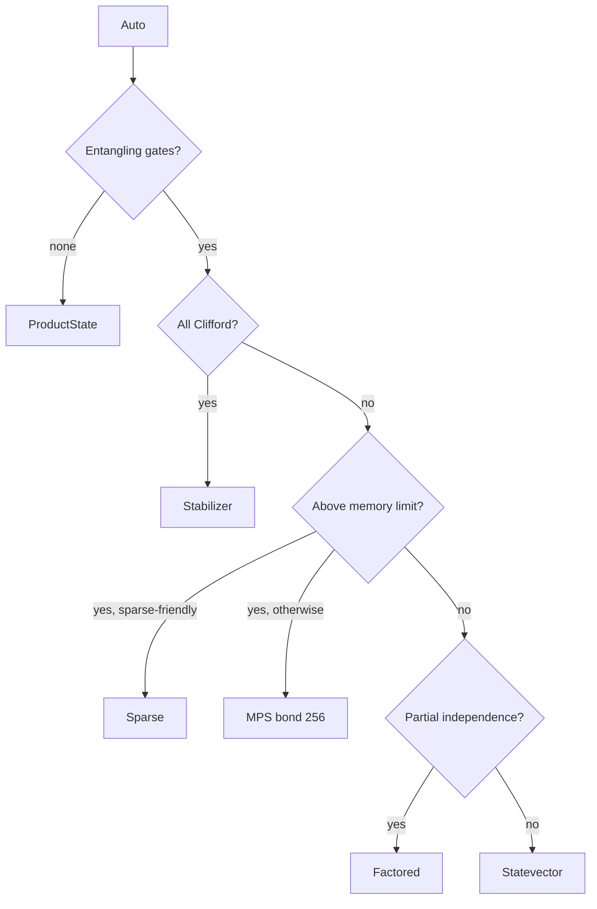

# Choosing a Backend

By default PRISM-Q inspects the circuit and picks a backend for you. You only need to
choose explicitly when you know something the auto-dispatcher cannot infer, or when you
are benchmarking a specific representation.

## Let it choose

```rust
use prism_q::simulate;

let result = simulate(&circuit).seed(42).run().unwrap();   // BackendKind::Auto
```

Auto-dispatch walks this decision tree:



## Choose explicitly

```rust
use prism_q::{simulate, BackendKind};

let result = simulate(&circuit)
    .backend(BackendKind::Stabilizer)
    .seed(42)
    .run()
    .unwrap();
```

## Symptom to backend

| If your circuit... | Use | Why |
|--------------------|-----|-----|
| Is Clifford-only (H, S, CX, CZ, ...) | `Stabilizer` | O(n²), scales to thousands of qubits |
| Has no entangling gates | `ProductState` | O(n), per-qubit state |
| Is dense and ≤ ~28 qubits | `Statevector` | Exact, fastest for the general case |
| Stays concentrated in few basis states | `Sparse` | O(k) in nonzero amplitudes |
| Has low entanglement but many qubits | `Mps { max_bond_dim }` | Polynomial memory in bond dim |
| Splits into independent sub-registers | `Factored` | Simulates blocks separately, merges lazily |
| Is Clifford + a few T gates | See [Clifford+T](../guides/clifford-t.md) | Beats dense statevector |

```admonish warning title="ProductState rejects entanglement"
`ProductState` errors on any entangling gate by design. Auto-dispatch only selects it for
circuits that have none. Choose it explicitly only when you know the circuit is a product
state throughout.
```

The [Backends Deep Dive](../guides/backends.md) and the
[architecture reference](../architecture/backends.md) cover each backend's internals.
