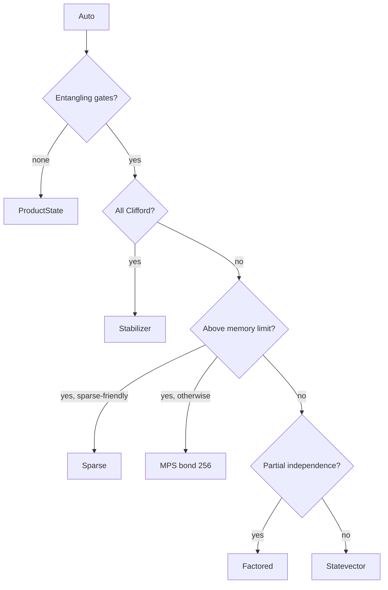

# Choosing a Backend

By default PRISM-Q inspects the circuit and picks a backend. Choose one explicitly when
you know something the dispatcher cannot infer, or when benchmarking a specific
representation.

## Let it choose

```rust
use prism_q::simulate;

let result = simulate(&circuit).seed(42).run().unwrap();   // BackendKind::Auto
```

Auto-dispatch walks this decision tree:


```mermaid
flowchart TD
    A[Auto] --> E{Entangling gates?}
    E -- none --> PS[ProductState]
    E -- yes --> CL{All Clifford?}
    CL -- yes --> STB[Stabilizer]
    CL -- no --> MEM{Above memory limit?}
    MEM -- "yes, sparse-friendly" --> SPR[Sparse]
    MEM -- "yes, otherwise" --> MPS[MPS bond 256]
    MEM -- no --> IND{Partial independence?}
    IND -- yes --> FAC[Factored]
    IND -- no --> SV[Statevector]
```

Two routes sit outside the tree: a large Clifford circuit that splits into independent
blocks goes to `FactoredStabilizer`, and a Clifford+T circuit with few T gates tries the
stabilizer rank and Pauli propagation engines first. The memory limit is half of
physical memory unless `PRISM_MAX_SV_QUBITS` sets it.

## Choose explicitly

```rust
use prism_q::{simulate, BackendKind};

let result = simulate(&circuit)
    .backend(BackendKind::Stabilizer)
    .seed(42)
    .run()
    .unwrap();
```

## Symptom to backend

| If your circuit... | Use | Why |
|--------------------|-----|-----|
| Is Clifford-only (H, S, CX, CZ, ...) | `Stabilizer` | O(n²), scales to thousands of qubits |
| Has no entangling gates | `ProductState` | O(n), per-qubit state |
| Is dense and ≤ ~28 qubits | `Statevector` | Exact, fastest for the general case |
| Stays concentrated in few basis states | `Sparse` | O(k) in nonzero amplitudes |
| Has low entanglement but many qubits | `Mps { max_bond_dim }` | Polynomial memory in bond dim |
| Splits into independent sub-registers | `Factored` | Simulates blocks separately, merges lazily |
| Is Clifford + a few T gates | See [Clifford+T](../guides/clifford-t.md) | Beats dense statevector |

```admonish warning title="ProductState rejects entanglement"
`ProductState` errors on any entangling gate. Auto-dispatch selects it only for circuits
that have none; choose it explicitly only for a circuit that stays a product state
throughout.
```

The [Backends Deep Dive](../guides/backends.md) and the
[architecture reference](../architecture/backends.md) cover each backend's internals.
