# Drawing Circuits

A `Circuit` renders three ways from Rust: a Unicode wire diagram for the terminal, a
gate-density heatmap for circuits too large to read gate by gate, and self-contained SVG
of either. None of them simulate anything; they read the instruction list.

## Text diagrams

`Display` draws the circuit with default options, so `println!` is enough:

```rust
use prism_q::CircuitBuilder;

let circuit = CircuitBuilder::new_with_classical(3, 3)
    .h(0)
    .cx(0, 1)
    .rz(0.25, 1)
    .cx(1, 2)
    .ry(0.5, 2)
    .cz(0, 1)
    .t(2)
    .measure_all()
    .build();
println!("{circuit}");
# assert!(circuit.to_string().contains("Rz(0.2500)"));
```

```text
q[0]: ─H──@───────────────────────@──────M0────
          │                       │
q[1]: ────X───Rz(0.2500)──@───────Z──────M1────
                          │
q[2]: ────────────────────X───Ry(0.5000)──T─M2─
```

Gates are packed into moments, the columns, so gates on disjoint qubits share one. `@`
marks a control, `X` the target of a CX, and `Mk` a measurement into classical bit `k`.
Angles print to four decimals, or as a fraction of π when they are one.

`draw(&TextOptions)` takes the layout options:

| Field | Default | Effect |
|-------|---------|--------|
| `fold_width` | 120 | Line width in characters before the diagram folds into stacked sections |
| `show_idle_wires` | `true` | Draw qubits that no gate touches |
| `show_barriers` | `true` | Draw barrier instructions |
| `max_qubits` | `None` | Draw at most this many wires and note how many were left out |
| `max_moments` | `None` | Draw at most this many moments and note the truncation |

A narrow fold splits the same circuit across sections, separated by a dashed rule:

```rust
use prism_q::{CircuitBuilder, TextOptions};

# let circuit = CircuitBuilder::new_with_classical(3, 3)
#     .h(0).cx(0, 1).rz(0.25, 1).cx(1, 2).ry(0.5, 2).cz(0, 1).t(2).measure_all().build();
let opts = TextOptions {
    fold_width: 40,
    ..TextOptions::default()
};
println!("{}", circuit.draw(&opts));
```

```text
q[0]: ─H──@──────────────────
          │
q[1]: ────X───Rz(0.2500)──@──
                          │
q[2]: ────────────────────X──
╌╌╌╌╌╌╌╌╌╌╌╌╌╌╌╌╌╌╌╌╌╌╌╌
q[0]: ─────@──────M0────
           │
q[1]: ─────Z──────M1────
q[2]: ─Ry(0.5000)──T─M2─
```

`max_qubits` and `max_moments` crop a larger circuit to its corner:

```rust
use prism_q::TextOptions;
use prism_q::circuits::ghz_circuit;

let opts = TextOptions {
    max_qubits: Some(3),
    max_moments: Some(4),
    ..TextOptions::default()
};
let text = ghz_circuit(8).draw(&opts);
assert!(text.contains("and 5 more qubits"));
```

```text
q[0]: ─H──@──────────
          │
q[1]: ────X───@──────
              │
q[2]: ────────X───@──
  ... and 5 more qubits
  ... truncated at moment 4 of 8
```

Past 64 qubits or 500 moments, `draw` returns `summary()` instead: gate counts,
connectivity, a depth profile, qubit activity, a heatmap, and a classification such as
`Clifford-only`. Call `summary()` directly to get it for any circuit.

## Heatmaps

`heatmap(&TextOptions)` shows where the gates are rather than what they are: one row per
qubit, one column per moment, a filled cell where a gate acts. Rows and columns are
bucketed to fit within `fold_width`, and the legend gives the gate count each shade
stands for. A hardware-efficient ansatz shows its CX ladder as a diagonal band:

```rust
use prism_q::TextOptions;
use prism_q::circuits::hardware_efficient_ansatz;

let text = hardware_efficient_ansatz(8, 3, 42).heatmap(&TextOptions::default());
assert!(text.starts_with("Gate density heatmap (8 qubits x 17 moments)"));
```

```text
Gate density heatmap (8 qubits x 17 moments):
q[0]: █████ ███ █
q[1]: ████████████
q[2]: ██ ██████████
q[3]: ██  ██████████
q[4]: ██   ██████████
q[5]: ██    ██████████
q[6]: ██     ██████████
q[7]: ██      ███ ███ █
      0              16
  Legend: ' '=0  █=1
```

## SVG

`to_svg(&SvgOptions)` returns a complete `<svg>` document as a `String`, ready to write
to a file or embed in HTML or Markdown. `to_svg_heatmap` does the same for the heatmap,
adding marginal activity bars and a color scale.

```rust,no_run
use prism_q::SvgOptions;
use prism_q::circuits::{ghz_circuit, hardware_efficient_ansatz};

let opts = SvgOptions {
    auto_theme: true,
    animate: false,
    show_legend: true,
    show_stats_header: true,
    compact: true,
    ..SvgOptions::default()
};
std::fs::write("ghz_5.svg", ghz_circuit(5).to_svg(&opts)).unwrap();
std::fs::write(
    "hea_12_heatmap.svg",
    hardware_efficient_ansatz(12, 4, 0xDEAD_BEEF).to_svg_heatmap(&opts),
)
.unwrap();
```

Those options produced the two diagrams below, which this site embeds as image files:




The `SvgOptions` fields fall into four groups. Lengths are in SVG user units.

| Group | Fields | Default |
|-------|--------|---------|
| Theme | `dark_mode`, `auto_theme` | light; `auto_theme` embeds both themes and follows `prefers-color-scheme`, overriding `dark_mode` |
| Annotations | `show_legend`, `show_stats_header`, `show_topology` | all off: a gate-category legend, a qubit, gate and depth line on top, and a qubit connectivity graph beside the circuit |
| Content | `show_idle_wires`, `show_barriers`, `max_qubits`, `max_moments`, `ellipsis_mode` | everything drawn; `ellipsis_mode: Some((first, last))` keeps the first and last moments with a gap between |
| Layout | `wire_spacing`, `moment_width`, `gate_height`, `gate_min_width`, `padding_*`, `font_size`, `control_radius`, `compact` | 40, 60, 28, 36, padding 60/20/20/20, 13 px, 3.5; `compact` shrinks spacing and fonts for dense embedding |

`animate` is on by default and adds CSS transitions, which a `prefers-reduced-motion`
query switches off. Turn it off for static output such as documentation.

```rust
use prism_q::SvgOptions;
use prism_q::circuits::qaoa_circuit;

let opts = SvgOptions {
    dark_mode: true,
    show_topology: true,
    ellipsis_mode: Some((3, 3)),
    ..SvgOptions::default()
};
let svg = qaoa_circuit(6, 3, 42).to_svg(&opts);
assert!(svg.starts_with("<svg"));
```

[`examples/gen_doc_diagrams.rs`](https://github.com/AbeCoull/prism-q/blob/main/examples/gen_doc_diagrams.rs)
regenerates every diagram on this site.
